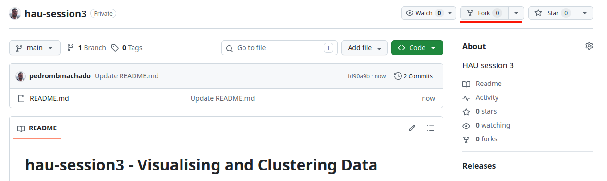
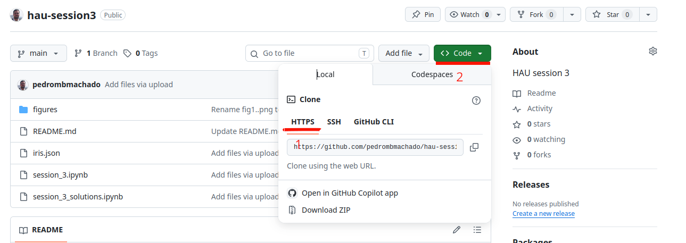
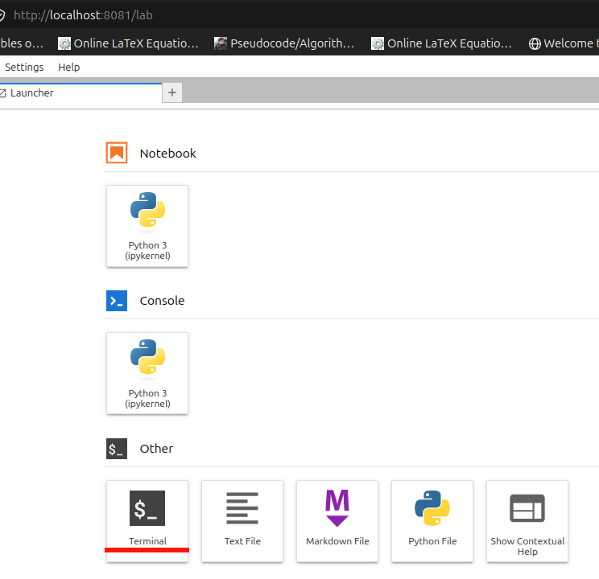
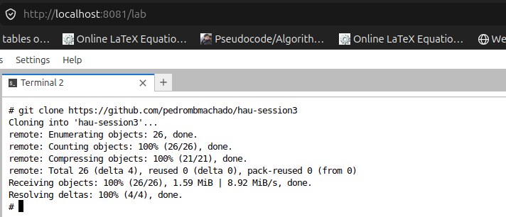
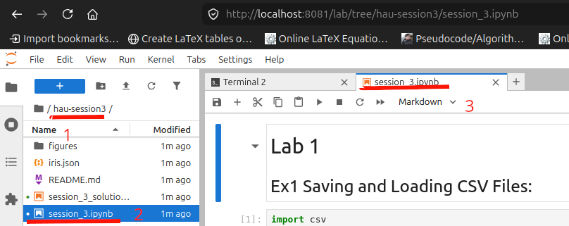
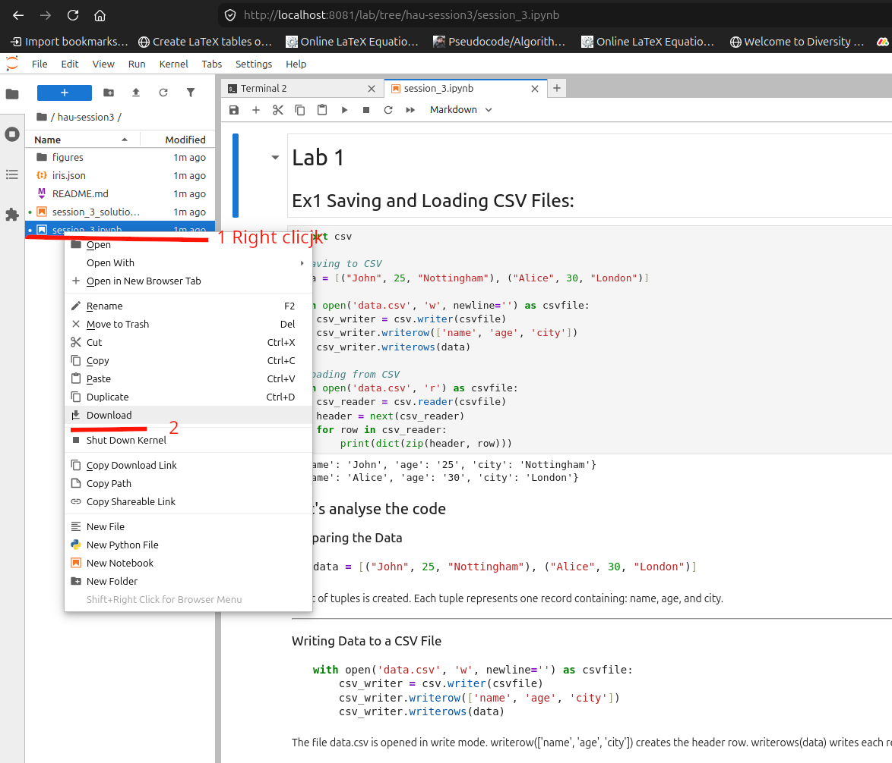
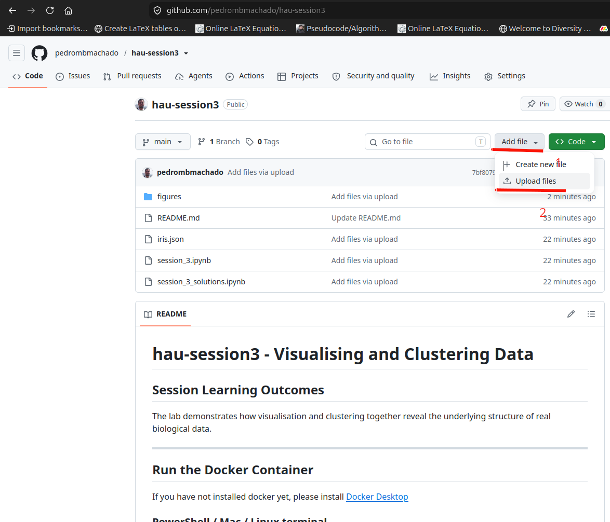

# hau-session3 - Visualising and Clustering Data

## Session Learning Outcomes

The lab demonstrates how visualisation and clustering together reveal the underlying structure of real biological data.

---

## Run the Docker Container

If you have not installed docker yet, please install [Docker Desktop](https://docs.docker.com/desktop/setup/install/windows-install/)

### PowerShell / Mac / Linux terminal

```bash
docker volume create docker_comp40731

docker pull pedrombmachado/nest:comp40731

docker run -d --rm --name comp40731_container -v docker_comp40731:/opt/data -e NEST_CONTAINER_MODE=jupyterlab -p 8081:8080 pedrombmachado/nest:comp40731
```

---

## Forking and Cloning the Project from the Git Repository

if you have not yet created a GitHub account, please create a [GitHub](https://github.com) account.

### Step 1: Log in to GitHub.com

Log in to [GitHub](https://github.com)

### Step 2: Fork the repository

Go to:

```text
https://github.com/pedrombmachado/hau-session3
```

and fork the repository.

**Figure 1:** Forking a repository.

### Step 3: Copy your repository URL

Go to your account repository, for example:

```text
user2/hau-session3
```

Click the **Code** button and copy the repository URL.


**Figure 2:** How to copy the repository URL.

### Step 4: Open JupyterLab

Open a tab in your preferred browser, such as Chrome, Firefox, Edge or Safari, and enter:

```text
http://localhost:8081/lab
```

Open a terminal in JupyterLab.

**Figure 3:** Open a terminal in JupyterLab.

### Step 5: Clone the repository

In the JupyterLab terminal, enter:

```bash
git clone https://github.com/USER/hau-session3
```

Replace `USER` with your GitHub user name.


**Figure 4:** Cloning the repository.

---

## Inspect and Analyse the Code from Ex1 to Ex15

### Step 6: Open and run the notebook

Open the `hau-session3` folder.

Then open:

```text
session_3.ipynb
```

Restart the kernel and run all cells.

**Figure 5:** Opening the `hau-session3` folder and `session_3.ipynb`, restarting the kernel and running all cells.

---

# Apply Your Knowledge

## Visualisation and Clustering with the Iris Dataset

You will work with the file:

```text
iris.json
```

The dataset contains measurements of **150 iris flowers**, where each record has:

- `sepalLength`
- `sepalWidth`
- `petalLength`
- `petalWidth`
- `species` — `"setosa"`, `"versicolor"`, `"virginica"`

### Example record

```json
{
  "sepalLength": 5.1,
  "sepalWidth": 3.5,
  "petalLength": 1.4,
  "petalWidth": 0.2,
  "species": "setosa"
}
```

---

## Objective

By the end of this lab, you will:

- load and explore the Iris dataset;
- visualise the data in 2D and 3D;
- apply four clustering algorithms:
  - K-Means;
  - Hierarchical Agglomerative Clustering;
  - DBSCAN;
  - Gaussian Mixture Model;
- compare how each algorithm groups the same dataset;
- interpret the results scientifically.

---

## Task 1: Load the Dataset

Load `iris.json` into Python and inspect:

- number of samples;
- feature names;
- unique species labels.

Briefly describe what each feature represents biologically.

---

## Task 2: 2D Visualisation

Create a 2D scatter plot of:

```text
Sepal Length (x-axis) vs Sepal Width (y-axis)
```

Colour the points by species and include:

- axis labels;
- title;
- legend.

Explain what patterns you observe.

---

## Task 3: 3D Visualisation

Create a 3D scatter plot using:

```text
X = sepalLength
Y = sepalWidth
Z = petalLength
```

Use colour or marker type to represent species.

Explain why adding the third dimension improves separability.

---

## Task 4: Clustering Analysis

Apply all four clustering algorithms to the same feature set:

```python
[sepalLength, sepalWidth, petalLength, petalWidth]
```

Before clustering, normalise the features.

For each algorithm, you must include:

- the Python implementation;
- a 2D clustered plot;
- a 3D clustered plot;
- a written interpretation.

### Algorithms to apply

1. **K-Means**
   - `k = 3`

2. **Hierarchical Agglomerative Clustering**
   - Ward linkage
   - 3 clusters

3. **DBSCAN**
   - tune `eps`
   - tune `min_samples`

4. **Gaussian Mixture Model**
   - 3 components

---

## Task 5: Interpretation and Comparison

Write a comparison section answering the following questions:

- Which algorithm best separated the three species?
- Which algorithm struggled the most, and why?
- How did 2D and 3D views change your interpretation?
- Which algorithm would you choose for:
  - well-separated data;
  - noisy data;
  - overlapping clusters?

---

## Task 6: Download the changed ipynb file and upload it to your GitHub
Right click on `session_3.ipynb` and select `Download`

**Figure 6:** Download `session_3.ipynb` to your local machine.

Upload the `session_3.ipynb` to `https://github.com/USER/hau-session3`where USER is your GitHub User name.


**Figure 7:** Upload `session_3.ipynb` to GitHub from your Local machine.

## Task 7: Stop the container
In the Powershell/terminal
```bash
docker stop comp40731_container
```

